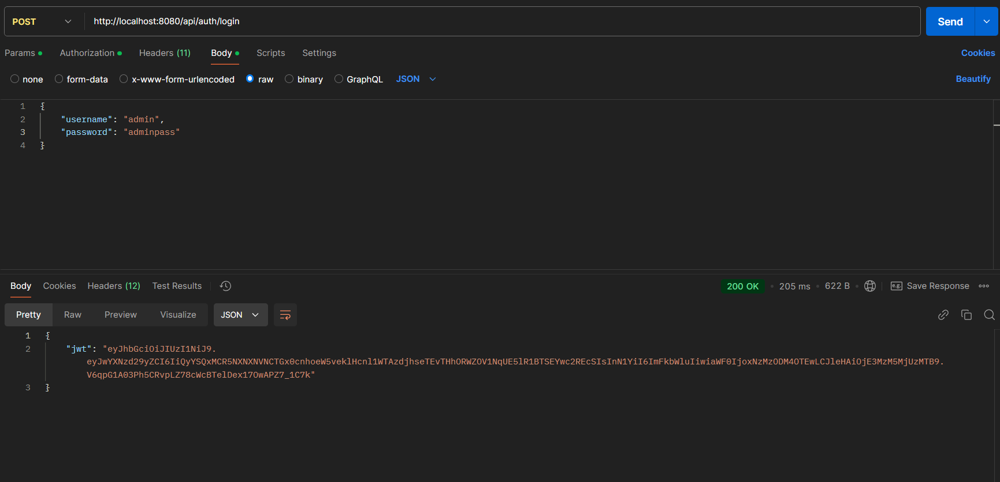
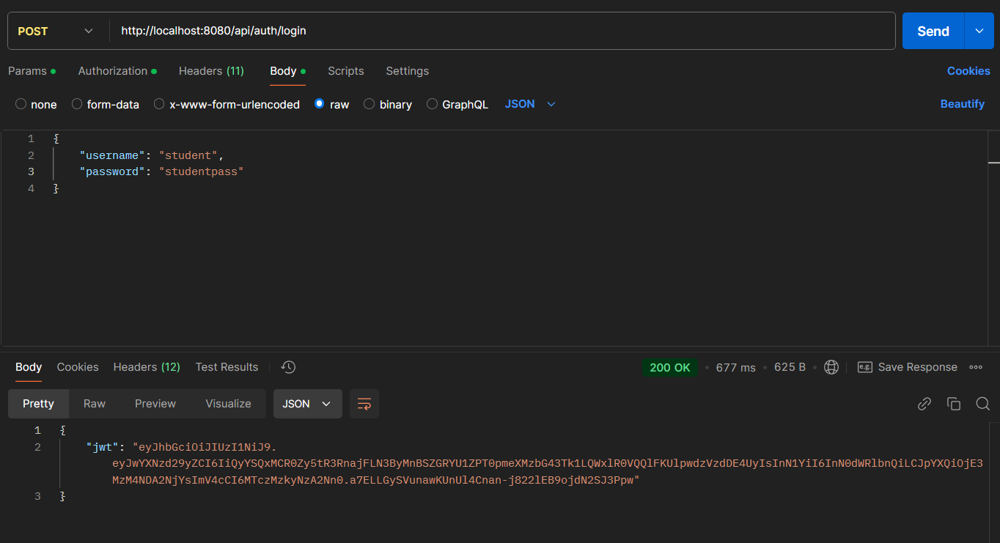
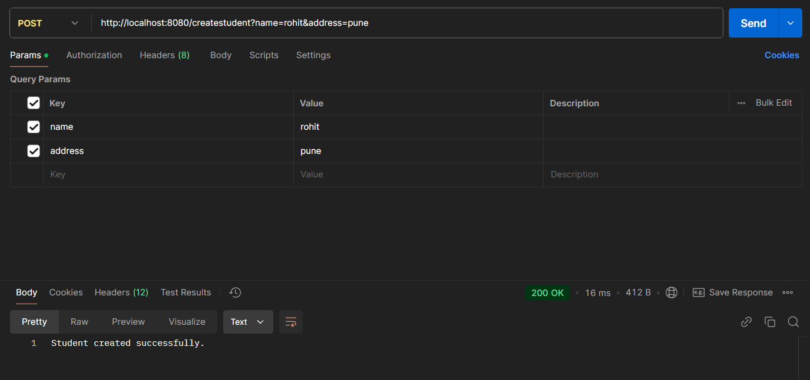
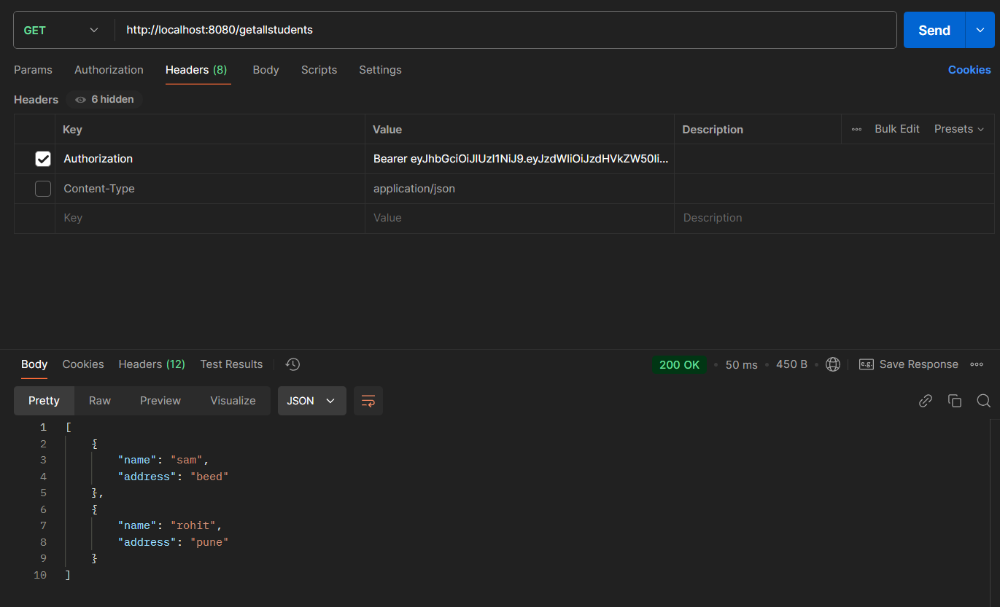
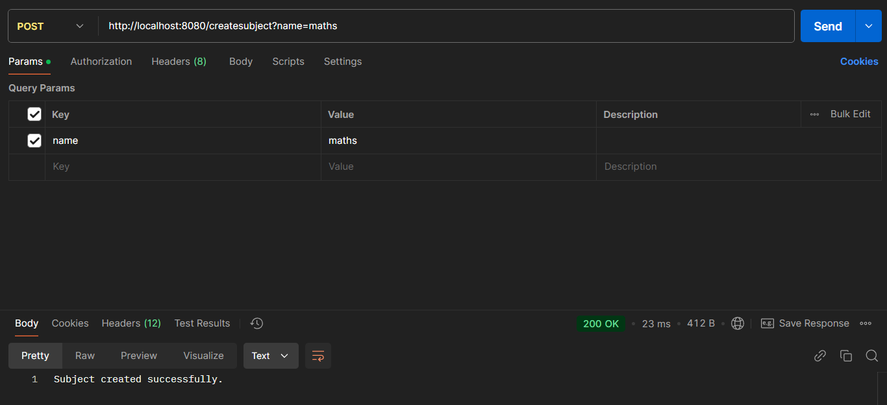
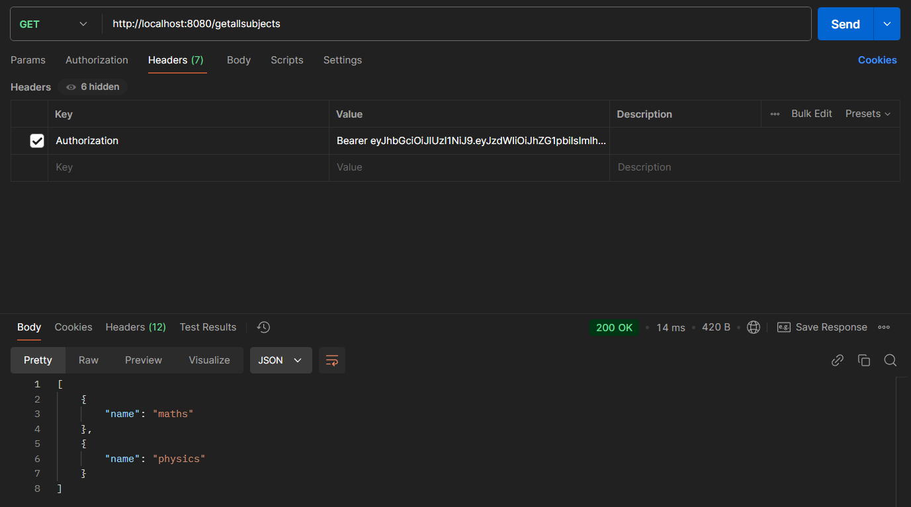
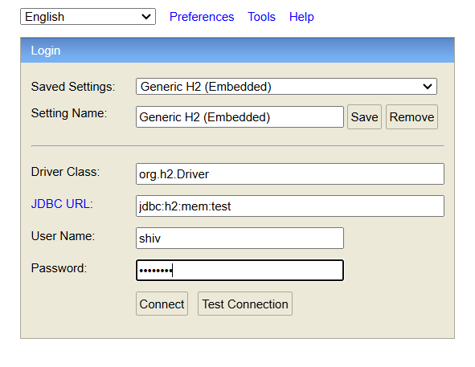
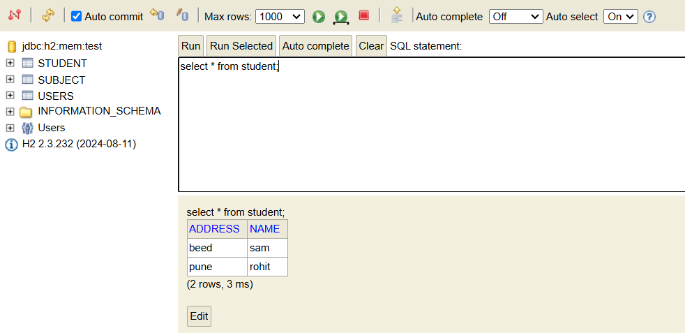
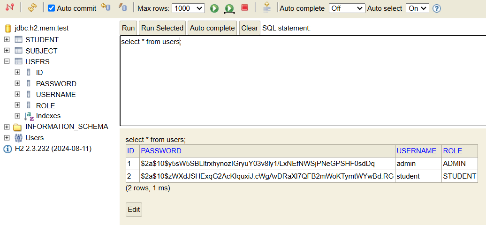
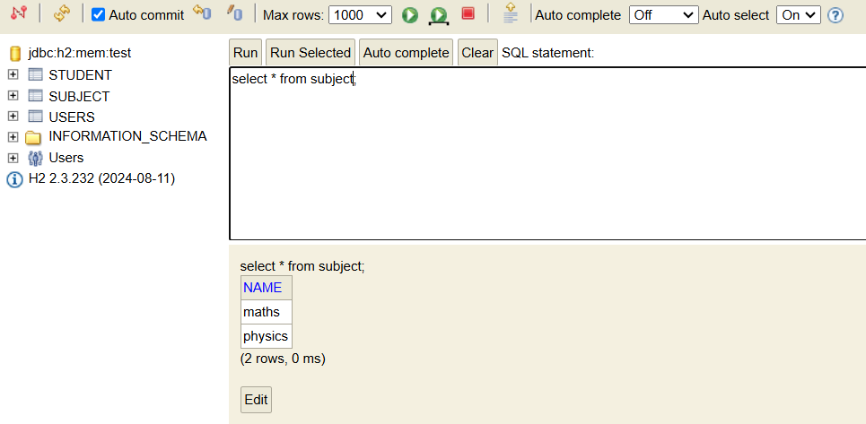

# Assignment

This project is a Spring Boot application that includes authentication and basic CRUD operations for managing students and subjects.

## Features
1. **Authentication**:
   - User login using JWT.
   - Secure access to API endpoints.

2. **Student Management**:
   - Add new students.
   - Retrieve all students.

3. **Subject Management**:
   - Add new subjects.
   - Retrieve all subjects.

---

## Requirements

Before setting up and running this project, ensure you have the following installed:

- **Java 8+**
- **Maven** (for dependency management)
- **MySQL** (for the database)
- **Postman** or any API client for testing
- **JDK Version: 19 or higher.**

---

## Setup Instructions

### 1. Clone the Repository

git clone https://github.com/shiv1919/Assignment

### 2. Reload Maven Dependencies
- **In IntelliJ IDEA:**
    Open the project in IntelliJ.
    Navigate to the Maven tool window (usually on the right side).
    Click the Reload Maven Projects button (🔄).
- **In Eclipse:**
    Right-click on the project in the Project Explorer.
    Select Maven > Update Project.
    
### 3. RUN  AssignmentApplication.java   
- **(Assignment/src/main/java/com/example/Assignment/AssignmentApplication.java)**

---

## API Endpoints

### Authentication

- **Login:**
    - Endpoint: POST /api/auth/login
- **Body:**
    - json: { "username": "user1", "password": "password123"}
#### There are two roles for login :
- **note:** Avoid creating users manually from the H2 console. Our application encrypts passwords during user creation and decrypts them during authentication. Manually creating users from the H2 console without encryption will result in authentication failures. Always use the application interface or API for user creation to ensure proper encryption.
#### 1.Admin
- **note:** username:admin, password:adminpass is added in database at run time as we dont have register API to create user.

#### 2.Student
- **note:** username:student, password:studentpass is added in database at run time as we dont have register API to create user.

- **note:** Copy jwt token received for further use.

---

### Student Management

#### Create Student

- **Endpoint:** POST /createstudent

- **Parameters:** name: Student name, address: Student address.

Provide the JWT token in the header received at the time of login.
.png>)

#### Get All Students

- **Endpoint:** GET /getallstudents
- **Response:** List of students.
 

### Subject Management

#### Create Subject

- **Endpoint:** POST /createsubject

- **Parameters:** name: Subject name.
 

Provide the JWT token in the header received at the time of login.
.png>) 

#### Get All Subjects

- **Endpoint:** GET /getallstudents
- **Response:** List of students.

## Accessing the H2 Console

Enter JDBC URL, Username, password
-   

Created students in table STUDENT

Create Subjects in table SUBJECT
 
 
Created Users in table USERS
